# Module_14_Challenge# Machine Learning Trading Bot

Now, it's time to take what you've learned about machine learning and apply it to new situations. For this optional assignment, you'll create an algorithmic trading bot that learns and adapts to new data and evolving markets. Be sure to give it your all -- as the skills you hone will become powerful tools in your FinTech tool belt.

## Background

In this Challenge, you’ll assume the role of a financial advisor at one of the top five financial advisory firms in the world. Your firm constantly competes with the other major firms to manage and automatically trade assets in a highly dynamic environment. In recent years, your firm has heavily profited by using computer algorithms that can buy and sell faster than human traders.

The speed of these transactions gave your firm a competitive advantage early on. But, people still need to specifically program these systems, which limits their ability to adapt to new data. You’re thus planning to improve the existing algorithmic trading systems and maintain the firm’s competitive advantage in the market. To do so, you’ll enhance the existing trading signals with machine learning algorithms that can adapt to new data.

## What You're Creating

You’ll combine your new algorithmic trading skills with your existing skills in financial Python programming and machine learning to create an algorithmic trading bot that learns and adapts to new data and evolving markets.

### Tune the Baseline Trading Algorithm

In this section, you’ll tune, or adjust, the model’s input features to find the parameters that result in the best trading outcomes. (You’ll choose the best by comparing the cumulative products of the strategy returns.) To do so, complete the following steps:

Step 1. Tune the training algorithm by adjusting the size of the training dataset. To do so, slice your data into different periods. Rerun the notebook with the updated parameters, and record the results in your `README.md` file. Answer the following question: What impact resulted from increasing or decreasing the training window?

    > **Hint** To adjust the size of the training dataset, you can use a different `DateOffset` value&mdash;for example, six months. Be aware that changing the size of the training dataset also affects the size of the testing dataset.

The original training data with an offset of 3 month
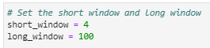

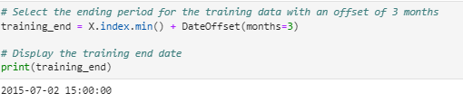

This is the report with the three months period
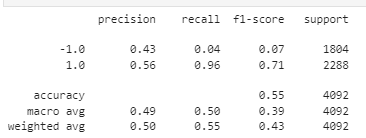

This is the a cumulative return plot based on three months training data.
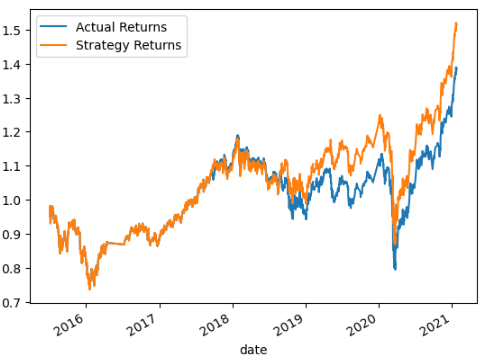

Whereas this is training data with an offset of 6 month

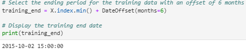

This is the report with the three months period
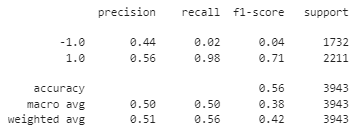

This is the a cumulative return plot based on three months training data.
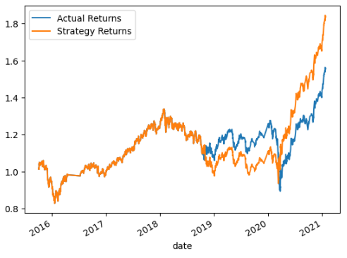

**Answer:** With changing the offset period from three months to six months, the accuracy has increased by 1% to be 56%. As a result, actual returns and strategy returns increased by 20% respectively.

Step 2. Tune the trading algorithm by adjusting the SMA input features. Adjust one or both of the windows for the algorithm. Rerun the notebook with the updated parameters, and record the results in your `README.md` file. Answer the following question: What impact resulted from increasing or decreasing either or both of the SMA windows?

This is the plot using 50 as the short window and 100 as the long window. 
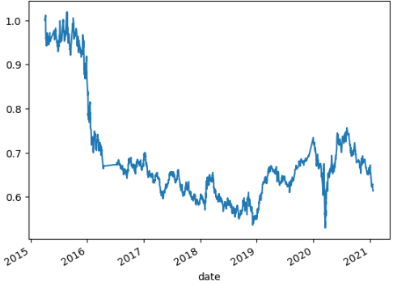

**Answer:** Although I changed the short window from 4 to 50, there was no significant difference.  

Step 3. Choose the set of parameters that best improved the trading algorithm returns. Save a PNG image of the cumulative product of the actual returns vs. the strategy returns, and document your conclusion in your `README.md` file.

Chosen parameters: short window: 10, long windows: 100, off set data: 6 months.

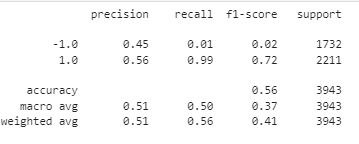

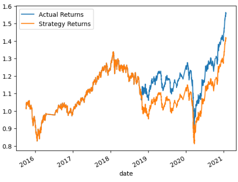

**Answer:** By changing some of parameters (Please see above chosen parameters), the accuracy increased by 1% to be 56%. The returns as shown in the plot increase about 10%.

### Evaluate a New Machine Learning Classifier

In this section, you’ll use the original parameters that the starter code provided. But, you’ll apply them to the performance of a second machine learning model. To do so, complete the following steps:

1. Import a new classifier, such as `AdaBoost`, `DecisionTreeClassifier`, or `LogisticRegression`. (For the full list of classifiers, refer to the [Supervised learning page](https://scikit-learn.org/stable/supervised_learning.html) in the scikit-learn documentation.)

2. Using the original training data as the baseline model, fit another model with the new classifier.

3. Backtest the new model to evaluate its performance. Save a PNG image of the cumulative product of the actual returns vs. the strategy returns for this updated trading algorithm, and write your conclusions in your `README.md` file. Answer the following questions: Did this new model perform better or worse than the provided baseline model? Did this new model perform better or worse than your tuned trading algorithm?

### Create an Evaluation Report

In the previous sections, you updated your `README.md` file with your conclusions. To accomplish this section, you need to add a summary evaluation report at the end of the `README.md` file. For this report, express your final conclusions and analysis. Support your findings by using the PNG images that you created.

I used the AdaBoost classifer to compare to the original data.

The report shows:  
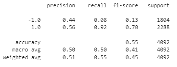

The plot with using AdaBoost shows:  
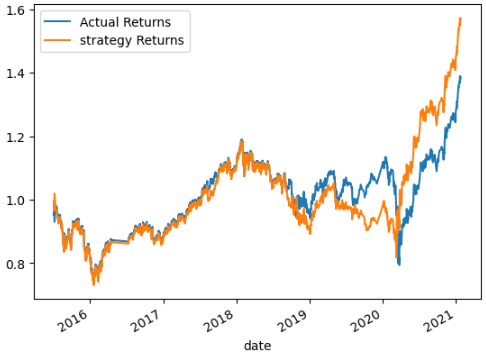

**Answer:** As a result of using AdaBoost classifier, the accuracy did not change as 55% as original report. However, returns increased by 10% equals to 1.6. The AdaBoost classifier has derived the better result.  

---

## Submission

* Use the started code provided to create the machine learning trading bot and host the notebook and the required files.

* Include a `README.md` file with your conclusions as requested.

* Submit the link to your GitHub project to Bootcamp Spot.

---

© 2022 edX Boot Camps LLC. Confidential and Proprietary. All Rights Reserved.